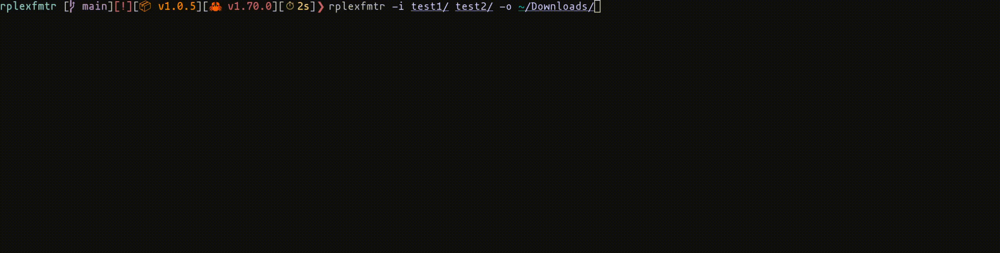

# rplexfmtr

Quick, easy to use, cross platform utility for batch renaming of video files for Plex® Media Server TV Shows.




## Usage
```bash
plexfmtr -p [input_folder(s)] -o [output_folder]
```
Where input_folders(s) is the folder containing the media to be renamed. You can input multiple media folders as a space separated list.
The output folder is a single output directory where the the series will be moved to. \
**NOTE:** The output directory will serve as the root of the output folder structure for the individual series entries. For example: if you input a show called `Bob` whose episodes belong to `season 1` with the output directory being `~/`. The episodes will be located in `~/Downloads/Bob/Season 1/`.

## Install 
You can install rplexfmtr via cargo using the following command:
```bash
cargo install rplexfmtr
```

## Step-by-step Example


Here we give the folder(s) containing the files we want to rename using the -p flag and specify where we want to move the files using the -o flag.

After pressing enter, we are shown the first input directory given and rplexfmtr asks us what would you like the files in folder highlighted in green.


After, we can input a name as we would be renaming a file.


After pressing enter once again, we will be shown a list of the files within the directory highlighted in green.

 \
Once here we can choose which files we would like to rename. We can input a range in the prompt in the any of the following formats:
- Dual ended range. For example, `0-2` will choose files `0,1,2` from the files presented above.
- Left ended range: For example, `1-` will choose files `1,2,3`, from the files presented above.
- Right ended range: For example, `-2` will choose files `0,1,2`, from the files presented above.
- Comma Separated Values: For example, `0,1,3` will chooses files `0,1,3`, from the files presented above.
- Space separated values: For example, `2 1 3` will choose files `1,2,3`, from the files presented above.
- Whole list: If you press enter without giving a range, all the files will be selected. For example, files `0,1,2,3` will be chosen, from the files presented above.

**NOTE:** If a value provided by the user is not in the list, for example `4` in the above example, this number will be discarded.

After pressing enter, we are asked what season number do these files belong to.
  

If there are more input directories given, we will be prompted give a name, chose the files and give a season for all input directories.

Once all input directories have been processed, we are prompted to preview the changes that we are going to make to the files. If we type `y`, a table is presented showing the changes that we inputted.


Finally, we are asked if we are happy with these changes and if we would like to execute these changes by typing `y` and then pressing enter. 

Once the renaming process is complete, rplexfmtr will remind us where the files where all the folders are located.

## Building from source
First clone the master branch of the github repo:
```bash
git clone "https://github.com/nikolaizombie1/rplexfmtr.git"
```
Then enter the rplexfmtr directory:
```bash
cd rxplexfmtr
```
Then, compile the binary:
```bash
cargo build --release
```
The standalone binary will be located in `target/release/rplexfmtr`